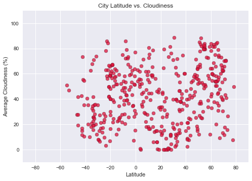
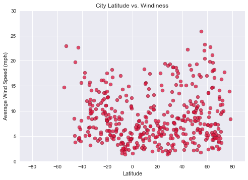
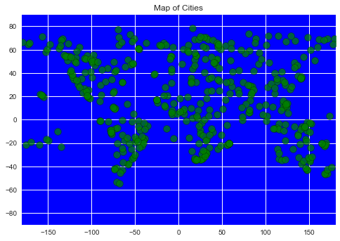

# WeatherPy

Analysis
- Average temperature generally increases the closer a location is to the equator
- The variance of temperature ranges appears to increase the further a location is from the equator. Average temperatures for locations within ~5 degrees of the equator only vary by about 20 degrees Fahrenheit, while temperatures around 70 degress latitude vary from about -30 degrees to 35 degress Fahrenheit.
- Their are not strongly discernable trends between latitude and humidity, cloudiness, and windiness. However there may be a loose correlation between increased humidity at higher latitudes and increased windiness further from the equator.

Note: For this analysis I used the OpenWeatherMap APIs 5 day forecast to ensure that temperatures and other data points were averaged out for all times of day. Ideally historical data would be used, but that data is only available at a cost. Using the historical weather data may be a future improvement.


```python
import pandas as pd
import numpy as np
import matplotlib.pyplot as plt
from citipy import citipy
import requests
import json
import random
from config import owm_api_key
plt.style.use('seaborn')
```

# Generate List of Cities


```python
cities = pd.DataFrame({
    "City":[],
    "Country":[],
    "Latitude":[],
    "Longitude":[]
})

city_names = []
country_codes = []
lats = []
lngs = []
duplicate = True

# generate 500 random geo-coordinates, if city is already in list - generate new coordinates
for i in range(0, 500):
    duplicate = True
    while duplicate == True:
        lat = random.uniform(-90, 90)
        lng = random.uniform(-180, 180)
        location = (lat, lng)
        city = citipy.nearest_city(lat, lng)
        city_name = city.city_name
        country_code = city.country_code
        
        dup_found = False
        for existing_city in city_names:
            if city_name == existing_city:
                dup_found = True
            
        if dup_found == False:
            city_names.append(city_name)
            country_codes.append(country_code)
            lats.append(lat)
            lngs.append(lng)
            duplicate = False

# create dataframe from list of cities            
cities["City"] = city_names
cities["Country"] = country_codes
cities["Latitude"] = lats
cities["Longitude"] = lngs
city_count = len(cities["City"])
print(f"Successfully generated a list of {city_count} cities.")
cities.head()
```

    Successfully generated a list of 500 cities.
    


<div>
<style>
    .dataframe thead tr:only-child th {
        text-align: right;
    }

    .dataframe thead th {
        text-align: left;
    }

    .dataframe tbody tr th {
        vertical-align: top;
    }
</style>
<table border="1" class="dataframe">
  <thead>
    <tr style="text-align: right;">
      <th></th>
      <th>City</th>
      <th>Country</th>
      <th>Latitude</th>
      <th>Longitude</th>
    </tr>
  </thead>
  <tbody>
    <tr>
      <th>0</th>
      <td>punta arenas</td>
      <td>cl</td>
      <td>-75.211011</td>
      <td>-89.893037</td>
    </tr>
    <tr>
      <th>1</th>
      <td>necochea</td>
      <td>ar</td>
      <td>-40.285380</td>
      <td>-57.819281</td>
    </tr>
    <tr>
      <th>2</th>
      <td>shenjiamen</td>
      <td>cn</td>
      <td>30.699112</td>
      <td>123.988955</td>
    </tr>
    <tr>
      <th>3</th>
      <td>choix</td>
      <td>mx</td>
      <td>26.521997</td>
      <td>-108.341476</td>
    </tr>
    <tr>
      <th>4</th>
      <td>mount isa</td>
      <td>au</td>
      <td>-18.260321</td>
      <td>140.264577</td>
    </tr>
  </tbody>
</table>
</div>


# Perform API Calls to OpenWeatherMap


```python
base_url = "http://api.openweathermap.org/data/2.5/forecast"
responses = []
i = 0

for index, row in cities.iterrows():
    i = i+1
    city_name = row["City"]
    country_code = row["Country"]
    params = {
        "q":f"{city_name},{country_code}",
        "appid":owm_api_key,
        "units":"imperial"
    }
    print(f"Retrieving data for city #{i} ({city_name}, {country_code})...")
    print(f"{base_url}?q={city_name},{country_code}&units=imperial&appid=***")
    response = requests.get(base_url, params=params).json()    
    responses.append(response)   
```

    Retrieving data for city #1 (punta arenas, cl)...
    http://api.openweathermap.org/data/2.5/forecast?q=punta arenas,cl&units=imperial&appid=***
    Retrieving data for city #2 (necochea, ar)...
    http://api.openweathermap.org/data/2.5/forecast?q=necochea,ar&units=imperial&appid=***
    Retrieving data for city #3 (shenjiamen, cn)...
    http://api.openweathermap.org/data/2.5/forecast?q=shenjiamen,cn&units=imperial&appid=***
    Retrieving data for city #4 (choix, mx)...
    http://api.openweathermap.org/data/2.5/forecast?q=choix,mx&units=imperial&appid=***
    Retrieving data for city #5 (mount isa, au)...
    http://api.openweathermap.org/data/2.5/forecast?q=mount isa,au&units=imperial&appid=***
    Retrieving data for city #6 (coahuayana, mx)...
    http://api.openweathermap.org/data/2.5/forecast?q=coahuayana,mx&units=imperial&appid=***
    Retrieving data for city #7 (bluff, nz)...
    http://api.openweathermap.org/data/2.5/forecast?q=bluff,nz&units=imperial&appid=***
    Retrieving data for city #8 (rikitea, pf)...
    http://api.openweathermap.org/data/2.5/forecast?q=rikitea,pf&units=imperial&appid=***
    Retrieving data for city #9 (pailon, bo)...
    http://api.openweathermap.org/data/2.5/forecast?q=pailon,bo&units=imperial&appid=***
    Retrieving data for city #10 (inhambane, mz)...
    http://api.openweathermap.org/data/2.5/forecast?q=inhambane,mz&units=imperial&appid=***
    Retrieving data for city #11 (jamestown, sh)...
    http://api.openweathermap.org/data/2.5/forecast?q=jamestown,sh&units=imperial&appid=***
    Retrieving data for city #12 (kodiak, us)...
    http://api.openweathermap.org/data/2.5/forecast?q=kodiak,us&units=imperial&appid=***
    Retrieving data for city #13 (vaini, to)...
    http://api.openweathermap.org/data/2.5/forecast?q=vaini,to&units=imperial&appid=***
    Retrieving data for city #14 (ancud, cl)...
    http://api.openweathermap.org/data/2.5/forecast?q=ancud,cl&units=imperial&appid=***
    Retrieving data for city #15 (dongsheng, cn)...
    http://api.openweathermap.org/data/2.5/forecast?q=dongsheng,cn&units=imperial&appid=***
    Retrieving data for city #16 (chokurdakh, ru)...
    http://api.openweathermap.org/data/2.5/forecast?q=chokurdakh,ru&units=imperial&appid=***
    Retrieving data for city #17 (kapaa, us)...
    http://api.openweathermap.org/data/2.5/forecast?q=kapaa,us&units=imperial&appid=***
    Retrieving data for city #18 (ushuaia, ar)...
    http://api.openweathermap.org/data/2.5/forecast?q=ushuaia,ar&units=imperial&appid=***
    Retrieving data for city #19 (santa vitoria, br)...
    http://api.openweathermap.org/data/2.5/forecast?q=santa vitoria,br&units=imperial&appid=***
    Retrieving data for city #20 (husavik, is)...
    http://api.openweathermap.org/data/2.5/forecast?q=husavik,is&units=imperial&appid=***
    Retrieving data for city #21 (cape town, za)...
    http://api.openweathermap.org/data/2.5/forecast?q=cape town,za&units=imperial&appid=***
    Retrieving data for city #22 (tautira, pf)...
    http://api.openweathermap.org/data/2.5/forecast?q=tautira,pf&units=imperial&appid=***
    Retrieving data for city #23 (hambantota, lk)...
    http://api.openweathermap.org/data/2.5/forecast?q=hambantota,lk&units=imperial&appid=***
    Retrieving data for city #24 (martapura, id)...
    http://api.openweathermap.org/data/2.5/forecast?q=martapura,id&units=imperial&appid=***
    Retrieving data for city #25 (kruisfontein, za)...
    http://api.openweathermap.org/data/2.5/forecast?q=kruisfontein,za&units=imperial&appid=***
    Retrieving data for city #26 (busselton, au)...
    http://api.openweathermap.org/data/2.5/forecast?q=busselton,au&units=imperial&appid=***
    Retrieving data for city #27 (asau, tv)...
    http://api.openweathermap.org/data/2.5/forecast?q=asau,tv&units=imperial&appid=***
    Retrieving data for city #28 (atuona, pf)...
    http://api.openweathermap.org/data/2.5/forecast?q=atuona,pf&units=imperial&appid=***
    Retrieving data for city #29 (cockburn town, bs)...
    http://api.openweathermap.org/data/2.5/forecast?q=cockburn town,bs&units=imperial&appid=***
    Retrieving data for city #30 (gujranwala, pk)...
    http://api.openweathermap.org/data/2.5/forecast?q=gujranwala,pk&units=imperial&appid=***
    Retrieving data for city #31 (tuktoyaktuk, ca)...
    http://api.openweathermap.org/data/2.5/forecast?q=tuktoyaktuk,ca&units=imperial&appid=***
    Retrieving data for city #32 (grindavik, is)...
    http://api.openweathermap.org/data/2.5/forecast?q=grindavik,is&units=imperial&appid=***
    Retrieving data for city #33 (avarua, ck)...
    http://api.openweathermap.org/data/2.5/forecast?q=avarua,ck&units=imperial&appid=***
    Retrieving data for city #34 (port hardy, ca)...
    http://api.openweathermap.org/data/2.5/forecast?q=port hardy,ca&units=imperial&appid=***
    Retrieving data for city #35 (erdenet, mn)...
    http://api.openweathermap.org/data/2.5/forecast?q=erdenet,mn&units=imperial&appid=***
    Retrieving data for city #36 (georgetown, sh)...
    http://api.openweathermap.org/data/2.5/forecast?q=georgetown,sh&units=imperial&appid=***
    Retrieving data for city #37 (port alfred, za)...
    http://api.openweathermap.org/data/2.5/forecast?q=port alfred,za&units=imperial&appid=***
    Retrieving data for city #38 (taolanaro, mg)...
    http://api.openweathermap.org/data/2.5/forecast?q=taolanaro,mg&units=imperial&appid=***
    Retrieving data for city #39 (dikson, ru)...
    http://api.openweathermap.org/data/2.5/forecast?q=dikson,ru&units=imperial&appid=***
    Retrieving data for city #40 (iqaluit, ca)...
    http://api.openweathermap.org/data/2.5/forecast?q=iqaluit,ca&units=imperial&appid=***
    Retrieving data for city #41 (cockburn harbour, tc)...
    http://api.openweathermap.org/data/2.5/forecast?q=cockburn harbour,tc&units=imperial&appid=***
    Retrieving data for city #42 (mataura, pf)...
    http://api.openweathermap.org/data/2.5/forecast?q=mataura,pf&units=imperial&appid=***
    Retrieving data for city #43 (karpogory, ru)...
    http://api.openweathermap.org/data/2.5/forecast?q=karpogory,ru&units=imperial&appid=***
    Retrieving data for city #44 (albany, au)...
    http://api.openweathermap.org/data/2.5/forecast?q=albany,au&units=imperial&appid=***
    Retrieving data for city #45 (yenagoa, ng)...
    http://api.openweathermap.org/data/2.5/forecast?q=yenagoa,ng&units=imperial&appid=***
    Retrieving data for city #46 (deori, in)...
    http://api.openweathermap.org/data/2.5/forecast?q=deori,in&units=imperial&appid=***
    Retrieving data for city #47 (lyubech, ua)...
    http://api.openweathermap.org/data/2.5/forecast?q=lyubech,ua&units=imperial&appid=***
    Retrieving data for city #48 (khonuu, ru)...
    http://api.openweathermap.org/data/2.5/forecast?q=khonuu,ru&units=imperial&appid=***
    Retrieving data for city #49 (yellowknife, ca)...
    http://api.openweathermap.org/data/2.5/forecast?q=yellowknife,ca&units=imperial&appid=***
    Retrieving data for city #50 (bredasdorp, za)...
    http://api.openweathermap.org/data/2.5/forecast?q=bredasdorp,za&units=imperial&appid=***
    Retrieving data for city #51 (lata, sb)...
    http://api.openweathermap.org/data/2.5/forecast?q=lata,sb&units=imperial&appid=***
    Retrieving data for city #52 (leningradskiy, ru)...
    http://api.openweathermap.org/data/2.5/forecast?q=leningradskiy,ru&units=imperial&appid=***
    Retrieving data for city #53 (esperance, au)...
    http://api.openweathermap.org/data/2.5/forecast?q=esperance,au&units=imperial&appid=***
    Retrieving data for city #54 (doha, kw)...
    http://api.openweathermap.org/data/2.5/forecast?q=doha,kw&units=imperial&appid=***
    Retrieving data for city #55 (bathsheba, bb)...
    http://api.openweathermap.org/data/2.5/forecast?q=bathsheba,bb&units=imperial&appid=***
    Retrieving data for city #56 (henties bay, na)...
    http://api.openweathermap.org/data/2.5/forecast?q=henties bay,na&units=imperial&appid=***
    Retrieving data for city #57 (upernavik, gl)...
    http://api.openweathermap.org/data/2.5/forecast?q=upernavik,gl&units=imperial&appid=***
    Retrieving data for city #58 (lorengau, pg)...
    http://api.openweathermap.org/data/2.5/forecast?q=lorengau,pg&units=imperial&appid=***
    Retrieving data for city #59 (namatanai, pg)...
    http://api.openweathermap.org/data/2.5/forecast?q=namatanai,pg&units=imperial&appid=***
    Retrieving data for city #60 (karla, ee)...
    http://api.openweathermap.org/data/2.5/forecast?q=karla,ee&units=imperial&appid=***
    Retrieving data for city #61 (hilo, us)...
    http://api.openweathermap.org/data/2.5/forecast?q=hilo,us&units=imperial&appid=***
    Retrieving data for city #62 (klaksvik, fo)...
    http://api.openweathermap.org/data/2.5/forecast?q=klaksvik,fo&units=imperial&appid=***
    Retrieving data for city #63 (dombarovskiy, ru)...
    http://api.openweathermap.org/data/2.5/forecast?q=dombarovskiy,ru&units=imperial&appid=***
    Retrieving data for city #64 (prainha, br)...
    http://api.openweathermap.org/data/2.5/forecast?q=prainha,br&units=imperial&appid=***
    Retrieving data for city #65 (yulara, au)...
    http://api.openweathermap.org/data/2.5/forecast?q=yulara,au&units=imperial&appid=***
    Retrieving data for city #66 (kamenka, ru)...
    http://api.openweathermap.org/data/2.5/forecast?q=kamenka,ru&units=imperial&appid=***
    Retrieving data for city #67 (puerto ayora, ec)...
    http://api.openweathermap.org/data/2.5/forecast?q=puerto ayora,ec&units=imperial&appid=***
    Retrieving data for city #68 (nanortalik, gl)...
    http://api.openweathermap.org/data/2.5/forecast?q=nanortalik,gl&units=imperial&appid=***
    Retrieving data for city #69 (hobart, au)...
    http://api.openweathermap.org/data/2.5/forecast?q=hobart,au&units=imperial&appid=***
    Retrieving data for city #70 (harper, lr)...
    http://api.openweathermap.org/data/2.5/forecast?q=harper,lr&units=imperial&appid=***
    Retrieving data for city #71 (svetlogorsk, ru)...
    http://api.openweathermap.org/data/2.5/forecast?q=svetlogorsk,ru&units=imperial&appid=***
    Retrieving data for city #72 (nishihara, jp)...
    http://api.openweathermap.org/data/2.5/forecast?q=nishihara,jp&units=imperial&appid=***
    Retrieving data for city #73 (santa isabel do rio negro, br)...
    http://api.openweathermap.org/data/2.5/forecast?q=santa isabel do rio negro,br&units=imperial&appid=***
    Retrieving data for city #74 (cabra, ph)...
    http://api.openweathermap.org/data/2.5/forecast?q=cabra,ph&units=imperial&appid=***
    Retrieving data for city #75 (hithadhoo, mv)...
    http://api.openweathermap.org/data/2.5/forecast?q=hithadhoo,mv&units=imperial&appid=***
    Retrieving data for city #76 (sataua, ws)...
    http://api.openweathermap.org/data/2.5/forecast?q=sataua,ws&units=imperial&appid=***
    Retrieving data for city #77 (belmonte, br)...
    http://api.openweathermap.org/data/2.5/forecast?q=belmonte,br&units=imperial&appid=***
    Retrieving data for city #78 (fortuna, us)...
    http://api.openweathermap.org/data/2.5/forecast?q=fortuna,us&units=imperial&appid=***
    Retrieving data for city #79 (kamina, cd)...
    http://api.openweathermap.org/data/2.5/forecast?q=kamina,cd&units=imperial&appid=***
    Retrieving data for city #80 (mahebourg, mu)...
    http://api.openweathermap.org/data/2.5/forecast?q=mahebourg,mu&units=imperial&appid=***
    Retrieving data for city #81 (burns lake, ca)...
    http://api.openweathermap.org/data/2.5/forecast?q=burns lake,ca&units=imperial&appid=***
    Retrieving data for city #82 (sentyabrskiy, ru)...
    http://api.openweathermap.org/data/2.5/forecast?q=sentyabrskiy,ru&units=imperial&appid=***
    Retrieving data for city #83 (garowe, so)...
    http://api.openweathermap.org/data/2.5/forecast?q=garowe,so&units=imperial&appid=***
    Retrieving data for city #84 (verkhoyansk, ru)...
    http://api.openweathermap.org/data/2.5/forecast?q=verkhoyansk,ru&units=imperial&appid=***
    Retrieving data for city #85 (atar, mr)...
    http://api.openweathermap.org/data/2.5/forecast?q=atar,mr&units=imperial&appid=***
    Retrieving data for city #86 (karakendzha, tj)...
    http://api.openweathermap.org/data/2.5/forecast?q=karakendzha,tj&units=imperial&appid=***
    Retrieving data for city #87 (mahon, es)...
    http://api.openweathermap.org/data/2.5/forecast?q=mahon,es&units=imperial&appid=***
    Retrieving data for city #88 (jaclupan, ph)...
    http://api.openweathermap.org/data/2.5/forecast?q=jaclupan,ph&units=imperial&appid=***
    Retrieving data for city #89 (butaritari, ki)...
    http://api.openweathermap.org/data/2.5/forecast?q=butaritari,ki&units=imperial&appid=***
    Retrieving data for city #90 (lompoc, us)...
    http://api.openweathermap.org/data/2.5/forecast?q=lompoc,us&units=imperial&appid=***
    Retrieving data for city #91 (chimbote, pe)...
    http://api.openweathermap.org/data/2.5/forecast?q=chimbote,pe&units=imperial&appid=***
    Retrieving data for city #92 (evensk, ru)...
    http://api.openweathermap.org/data/2.5/forecast?q=evensk,ru&units=imperial&appid=***
    Retrieving data for city #93 (ijaki, ki)...
    http://api.openweathermap.org/data/2.5/forecast?q=ijaki,ki&units=imperial&appid=***
    Retrieving data for city #94 (dembi dolo, et)...
    http://api.openweathermap.org/data/2.5/forecast?q=dembi dolo,et&units=imperial&appid=***
    Retrieving data for city #95 (arys, kz)...
    http://api.openweathermap.org/data/2.5/forecast?q=arys,kz&units=imperial&appid=***
    Retrieving data for city #96 (la ronge, ca)...
    http://api.openweathermap.org/data/2.5/forecast?q=la ronge,ca&units=imperial&appid=***
    Retrieving data for city #97 (wajima, jp)...
    http://api.openweathermap.org/data/2.5/forecast?q=wajima,jp&units=imperial&appid=***
    Retrieving data for city #98 (beni suef, eg)...
    http://api.openweathermap.org/data/2.5/forecast?q=beni suef,eg&units=imperial&appid=***
    Retrieving data for city #99 (kindu, cd)...
    http://api.openweathermap.org/data/2.5/forecast?q=kindu,cd&units=imperial&appid=***
    Retrieving data for city #100 (east london, za)...
    http://api.openweathermap.org/data/2.5/forecast?q=east london,za&units=imperial&appid=***
    Retrieving data for city #101 (isangel, vu)...
    http://api.openweathermap.org/data/2.5/forecast?q=isangel,vu&units=imperial&appid=***
    Retrieving data for city #102 (pevek, ru)...
    http://api.openweathermap.org/data/2.5/forecast?q=pevek,ru&units=imperial&appid=***
    Retrieving data for city #103 (anadyr, ru)...
    http://api.openweathermap.org/data/2.5/forecast?q=anadyr,ru&units=imperial&appid=***
    Retrieving data for city #104 (stanger, za)...
    http://api.openweathermap.org/data/2.5/forecast?q=stanger,za&units=imperial&appid=***
    Retrieving data for city #105 (maun, bw)...
    http://api.openweathermap.org/data/2.5/forecast?q=maun,bw&units=imperial&appid=***
    Retrieving data for city #106 (mar del plata, ar)...
    http://api.openweathermap.org/data/2.5/forecast?q=mar del plata,ar&units=imperial&appid=***
    Retrieving data for city #107 (saint-philippe, re)...
    http://api.openweathermap.org/data/2.5/forecast?q=saint-philippe,re&units=imperial&appid=***
    Retrieving data for city #108 (ketchikan, us)...
    http://api.openweathermap.org/data/2.5/forecast?q=ketchikan,us&units=imperial&appid=***
    Retrieving data for city #109 (hofn, is)...
    http://api.openweathermap.org/data/2.5/forecast?q=hofn,is&units=imperial&appid=***
    Retrieving data for city #110 (beloha, mg)...
    http://api.openweathermap.org/data/2.5/forecast?q=beloha,mg&units=imperial&appid=***
    Retrieving data for city #111 (batemans bay, au)...
    http://api.openweathermap.org/data/2.5/forecast?q=batemans bay,au&units=imperial&appid=***
    Retrieving data for city #112 (sao filipe, cv)...
    http://api.openweathermap.org/data/2.5/forecast?q=sao filipe,cv&units=imperial&appid=***
    Retrieving data for city #113 (aklavik, ca)...
    http://api.openweathermap.org/data/2.5/forecast?q=aklavik,ca&units=imperial&appid=***
    Retrieving data for city #114 (hasaki, jp)...
    http://api.openweathermap.org/data/2.5/forecast?q=hasaki,jp&units=imperial&appid=***
    Retrieving data for city #115 (port-gentil, ga)...
    http://api.openweathermap.org/data/2.5/forecast?q=port-gentil,ga&units=imperial&appid=***
    Retrieving data for city #116 (matamoros, mx)...
    http://api.openweathermap.org/data/2.5/forecast?q=matamoros,mx&units=imperial&appid=***
    Retrieving data for city #117 (bethel, us)...
    http://api.openweathermap.org/data/2.5/forecast?q=bethel,us&units=imperial&appid=***
    Retrieving data for city #118 (carutapera, br)...
    http://api.openweathermap.org/data/2.5/forecast?q=carutapera,br&units=imperial&appid=***
    Retrieving data for city #119 (nouadhibou, mr)...
    http://api.openweathermap.org/data/2.5/forecast?q=nouadhibou,mr&units=imperial&appid=***
    Retrieving data for city #120 (goianapolis, br)...
    http://api.openweathermap.org/data/2.5/forecast?q=goianapolis,br&units=imperial&appid=***
    Retrieving data for city #121 (khatanga, ru)...
    http://api.openweathermap.org/data/2.5/forecast?q=khatanga,ru&units=imperial&appid=***
    Retrieving data for city #122 (yarega, ru)...
    http://api.openweathermap.org/data/2.5/forecast?q=yarega,ru&units=imperial&appid=***
    Retrieving data for city #123 (cabo san lucas, mx)...
    http://api.openweathermap.org/data/2.5/forecast?q=cabo san lucas,mx&units=imperial&appid=***
    Retrieving data for city #124 (illoqqortoormiut, gl)...
    http://api.openweathermap.org/data/2.5/forecast?q=illoqqortoormiut,gl&units=imperial&appid=***
    Retrieving data for city #125 (ribeira grande, pt)...
    http://api.openweathermap.org/data/2.5/forecast?q=ribeira grande,pt&units=imperial&appid=***
    Retrieving data for city #126 (bandarbeyla, so)...
    http://api.openweathermap.org/data/2.5/forecast?q=bandarbeyla,so&units=imperial&appid=***
    Retrieving data for city #127 (kidal, ml)...
    http://api.openweathermap.org/data/2.5/forecast?q=kidal,ml&units=imperial&appid=***
    Retrieving data for city #128 (lagoa, pt)...
    http://api.openweathermap.org/data/2.5/forecast?q=lagoa,pt&units=imperial&appid=***
    Retrieving data for city #129 (carnarvon, au)...
    http://api.openweathermap.org/data/2.5/forecast?q=carnarvon,au&units=imperial&appid=***
    Retrieving data for city #130 (amderma, ru)...
    http://api.openweathermap.org/data/2.5/forecast?q=amderma,ru&units=imperial&appid=***
    Retrieving data for city #131 (noumea, nc)...
    http://api.openweathermap.org/data/2.5/forecast?q=noumea,nc&units=imperial&appid=***
    Retrieving data for city #132 (san carlos de bariloche, ar)...
    http://api.openweathermap.org/data/2.5/forecast?q=san carlos de bariloche,ar&units=imperial&appid=***
    Retrieving data for city #133 (baltar, pt)...
    http://api.openweathermap.org/data/2.5/forecast?q=baltar,pt&units=imperial&appid=***
    Retrieving data for city #134 (chuy, uy)...
    http://api.openweathermap.org/data/2.5/forecast?q=chuy,uy&units=imperial&appid=***
    Retrieving data for city #135 (port elizabeth, za)...
    http://api.openweathermap.org/data/2.5/forecast?q=port elizabeth,za&units=imperial&appid=***
    Retrieving data for city #136 (new norfolk, au)...
    http://api.openweathermap.org/data/2.5/forecast?q=new norfolk,au&units=imperial&appid=***
    Retrieving data for city #137 (vardo, no)...
    http://api.openweathermap.org/data/2.5/forecast?q=vardo,no&units=imperial&appid=***
    Retrieving data for city #138 (pokhara, np)...
    http://api.openweathermap.org/data/2.5/forecast?q=pokhara,np&units=imperial&appid=***
    Retrieving data for city #139 (sao miguel do iguacu, br)...
    http://api.openweathermap.org/data/2.5/forecast?q=sao miguel do iguacu,br&units=imperial&appid=***
    Retrieving data for city #140 (barrow, us)...
    http://api.openweathermap.org/data/2.5/forecast?q=barrow,us&units=imperial&appid=***
    Retrieving data for city #141 (bom jesus, br)...
    http://api.openweathermap.org/data/2.5/forecast?q=bom jesus,br&units=imperial&appid=***
    Retrieving data for city #142 (rio grande, br)...
    http://api.openweathermap.org/data/2.5/forecast?q=rio grande,br&units=imperial&appid=***
    Retrieving data for city #143 (victoria, sc)...
    http://api.openweathermap.org/data/2.5/forecast?q=victoria,sc&units=imperial&appid=***
    Retrieving data for city #144 (carlos chagas, br)...
    http://api.openweathermap.org/data/2.5/forecast?q=carlos chagas,br&units=imperial&appid=***
    Retrieving data for city #145 (arraial do cabo, br)...
    http://api.openweathermap.org/data/2.5/forecast?q=arraial do cabo,br&units=imperial&appid=***
    Retrieving data for city #146 (kaitangata, nz)...
    http://api.openweathermap.org/data/2.5/forecast?q=kaitangata,nz&units=imperial&appid=***
    Retrieving data for city #147 (tura, ru)...
    http://api.openweathermap.org/data/2.5/forecast?q=tura,ru&units=imperial&appid=***
    Retrieving data for city #148 (angoche, mz)...
    http://api.openweathermap.org/data/2.5/forecast?q=angoche,mz&units=imperial&appid=***
    Retrieving data for city #149 (porto novo, cv)...
    http://api.openweathermap.org/data/2.5/forecast?q=porto novo,cv&units=imperial&appid=***
    Retrieving data for city #150 (constitucion, mx)...
    http://api.openweathermap.org/data/2.5/forecast?q=constitucion,mx&units=imperial&appid=***
    Retrieving data for city #151 (chilca, pe)...
    http://api.openweathermap.org/data/2.5/forecast?q=chilca,pe&units=imperial&appid=***
    Retrieving data for city #152 (mozarlandia, br)...
    http://api.openweathermap.org/data/2.5/forecast?q=mozarlandia,br&units=imperial&appid=***
    Retrieving data for city #153 (killybegs, ie)...
    http://api.openweathermap.org/data/2.5/forecast?q=killybegs,ie&units=imperial&appid=***
    Retrieving data for city #154 (severomorsk, ru)...
    http://api.openweathermap.org/data/2.5/forecast?q=severomorsk,ru&units=imperial&appid=***
    Retrieving data for city #155 (zhigansk, ru)...
    http://api.openweathermap.org/data/2.5/forecast?q=zhigansk,ru&units=imperial&appid=***
    Retrieving data for city #156 (puerto colombia, co)...
    http://api.openweathermap.org/data/2.5/forecast?q=puerto colombia,co&units=imperial&appid=***
    Retrieving data for city #157 (hualmay, pe)...
    http://api.openweathermap.org/data/2.5/forecast?q=hualmay,pe&units=imperial&appid=***
    Retrieving data for city #158 (haines junction, ca)...
    http://api.openweathermap.org/data/2.5/forecast?q=haines junction,ca&units=imperial&appid=***
    Retrieving data for city #159 (ouesso, cg)...
    http://api.openweathermap.org/data/2.5/forecast?q=ouesso,cg&units=imperial&appid=***
    Retrieving data for city #160 (torbay, ca)...
    http://api.openweathermap.org/data/2.5/forecast?q=torbay,ca&units=imperial&appid=***
    Retrieving data for city #161 (mwinilunga, zm)...
    http://api.openweathermap.org/data/2.5/forecast?q=mwinilunga,zm&units=imperial&appid=***
    Retrieving data for city #162 (tsihombe, mg)...
    http://api.openweathermap.org/data/2.5/forecast?q=tsihombe,mg&units=imperial&appid=***
    Retrieving data for city #163 (mancio lima, br)...
    http://api.openweathermap.org/data/2.5/forecast?q=mancio lima,br&units=imperial&appid=***
    Retrieving data for city #164 (port blair, in)...
    http://api.openweathermap.org/data/2.5/forecast?q=port blair,in&units=imperial&appid=***
    Retrieving data for city #165 (qaqortoq, gl)...
    http://api.openweathermap.org/data/2.5/forecast?q=qaqortoq,gl&units=imperial&appid=***
    Retrieving data for city #166 (matara, lk)...
    http://api.openweathermap.org/data/2.5/forecast?q=matara,lk&units=imperial&appid=***
    Retrieving data for city #167 (jasper, ca)...
    http://api.openweathermap.org/data/2.5/forecast?q=jasper,ca&units=imperial&appid=***
    Retrieving data for city #168 (labuhan, id)...
    http://api.openweathermap.org/data/2.5/forecast?q=labuhan,id&units=imperial&appid=***
    Retrieving data for city #169 (coquimbo, cl)...
    http://api.openweathermap.org/data/2.5/forecast?q=coquimbo,cl&units=imperial&appid=***
    Retrieving data for city #170 (saskylakh, ru)...
    http://api.openweathermap.org/data/2.5/forecast?q=saskylakh,ru&units=imperial&appid=***
    Retrieving data for city #171 (cap malheureux, mu)...
    http://api.openweathermap.org/data/2.5/forecast?q=cap malheureux,mu&units=imperial&appid=***
    Retrieving data for city #172 (mayo, ca)...
    http://api.openweathermap.org/data/2.5/forecast?q=mayo,ca&units=imperial&appid=***
    Retrieving data for city #173 (mutoko, zw)...
    http://api.openweathermap.org/data/2.5/forecast?q=mutoko,zw&units=imperial&appid=***
    Retrieving data for city #174 (lazaro cardenas, mx)...
    http://api.openweathermap.org/data/2.5/forecast?q=lazaro cardenas,mx&units=imperial&appid=***
    Retrieving data for city #175 (vestmannaeyjar, is)...
    http://api.openweathermap.org/data/2.5/forecast?q=vestmannaeyjar,is&units=imperial&appid=***
    Retrieving data for city #176 (mount gambier, au)...
    http://api.openweathermap.org/data/2.5/forecast?q=mount gambier,au&units=imperial&appid=***
    Retrieving data for city #177 (severo-kurilsk, ru)...
    http://api.openweathermap.org/data/2.5/forecast?q=severo-kurilsk,ru&units=imperial&appid=***
    Retrieving data for city #178 (chengde, cn)...
    http://api.openweathermap.org/data/2.5/forecast?q=chengde,cn&units=imperial&appid=***
    Retrieving data for city #179 (krasnoarmeyskiy, ru)...
    http://api.openweathermap.org/data/2.5/forecast?q=krasnoarmeyskiy,ru&units=imperial&appid=***
    Retrieving data for city #180 (ouadda, cf)...
    http://api.openweathermap.org/data/2.5/forecast?q=ouadda,cf&units=imperial&appid=***
    Retrieving data for city #181 (catuday, ph)...
    http://api.openweathermap.org/data/2.5/forecast?q=catuday,ph&units=imperial&appid=***
    Retrieving data for city #182 (ponta do sol, cv)...
    http://api.openweathermap.org/data/2.5/forecast?q=ponta do sol,cv&units=imperial&appid=***
    Retrieving data for city #183 (palmer, us)...
    http://api.openweathermap.org/data/2.5/forecast?q=palmer,us&units=imperial&appid=***
    Retrieving data for city #184 (khash, ir)...
    http://api.openweathermap.org/data/2.5/forecast?q=khash,ir&units=imperial&appid=***
    Retrieving data for city #185 (geraldton, au)...
    http://api.openweathermap.org/data/2.5/forecast?q=geraldton,au&units=imperial&appid=***
    Retrieving data for city #186 (raga, sd)...
    http://api.openweathermap.org/data/2.5/forecast?q=raga,sd&units=imperial&appid=***
    Retrieving data for city #187 (naze, jp)...
    http://api.openweathermap.org/data/2.5/forecast?q=naze,jp&units=imperial&appid=***
    Retrieving data for city #188 (vaitupu, wf)...
    http://api.openweathermap.org/data/2.5/forecast?q=vaitupu,wf&units=imperial&appid=***
    Retrieving data for city #189 (kenai, us)...
    http://api.openweathermap.org/data/2.5/forecast?q=kenai,us&units=imperial&appid=***
    Retrieving data for city #190 (cairns, au)...
    http://api.openweathermap.org/data/2.5/forecast?q=cairns,au&units=imperial&appid=***
    Retrieving data for city #191 (broome, au)...
    http://api.openweathermap.org/data/2.5/forecast?q=broome,au&units=imperial&appid=***
    Retrieving data for city #192 (north battleford, ca)...
    http://api.openweathermap.org/data/2.5/forecast?q=north battleford,ca&units=imperial&appid=***
    Retrieving data for city #193 (narsaq, gl)...
    http://api.openweathermap.org/data/2.5/forecast?q=narsaq,gl&units=imperial&appid=***
    Retrieving data for city #194 (dunedin, nz)...
    http://api.openweathermap.org/data/2.5/forecast?q=dunedin,nz&units=imperial&appid=***
    Retrieving data for city #195 (terrace, ca)...
    http://api.openweathermap.org/data/2.5/forecast?q=terrace,ca&units=imperial&appid=***
    Retrieving data for city #196 (zhongxing, cn)...
    http://api.openweathermap.org/data/2.5/forecast?q=zhongxing,cn&units=imperial&appid=***
    Retrieving data for city #197 (jiddah, sa)...
    http://api.openweathermap.org/data/2.5/forecast?q=jiddah,sa&units=imperial&appid=***
    Retrieving data for city #198 (mpongwe, zm)...
    http://api.openweathermap.org/data/2.5/forecast?q=mpongwe,zm&units=imperial&appid=***
    Retrieving data for city #199 (estelle, us)...
    http://api.openweathermap.org/data/2.5/forecast?q=estelle,us&units=imperial&appid=***
    Retrieving data for city #200 (belushya guba, ru)...
    http://api.openweathermap.org/data/2.5/forecast?q=belushya guba,ru&units=imperial&appid=***
    Retrieving data for city #201 (ibra, om)...
    http://api.openweathermap.org/data/2.5/forecast?q=ibra,om&units=imperial&appid=***
    Retrieving data for city #202 (kanallakion, gr)...
    http://api.openweathermap.org/data/2.5/forecast?q=kanallakion,gr&units=imperial&appid=***
    Retrieving data for city #203 (pinyug, ru)...
    http://api.openweathermap.org/data/2.5/forecast?q=pinyug,ru&units=imperial&appid=***
    Retrieving data for city #204 (tomatlan, mx)...
    http://api.openweathermap.org/data/2.5/forecast?q=tomatlan,mx&units=imperial&appid=***
    Retrieving data for city #205 (benghazi, ly)...
    http://api.openweathermap.org/data/2.5/forecast?q=benghazi,ly&units=imperial&appid=***
    Retrieving data for city #206 (xichang, cn)...
    http://api.openweathermap.org/data/2.5/forecast?q=xichang,cn&units=imperial&appid=***
    Retrieving data for city #207 (fergus falls, us)...
    http://api.openweathermap.org/data/2.5/forecast?q=fergus falls,us&units=imperial&appid=***
    Retrieving data for city #208 (ilulissat, gl)...
    http://api.openweathermap.org/data/2.5/forecast?q=ilulissat,gl&units=imperial&appid=***
    Retrieving data for city #209 (kendari, id)...
    http://api.openweathermap.org/data/2.5/forecast?q=kendari,id&units=imperial&appid=***
    Retrieving data for city #210 (ostrovnoy, ru)...
    http://api.openweathermap.org/data/2.5/forecast?q=ostrovnoy,ru&units=imperial&appid=***
    Retrieving data for city #211 (machiques, ve)...
    http://api.openweathermap.org/data/2.5/forecast?q=machiques,ve&units=imperial&appid=***
    Retrieving data for city #212 (provideniya, ru)...
    http://api.openweathermap.org/data/2.5/forecast?q=provideniya,ru&units=imperial&appid=***
    Retrieving data for city #213 (utrecht, za)...
    http://api.openweathermap.org/data/2.5/forecast?q=utrecht,za&units=imperial&appid=***
    Retrieving data for city #214 (zurrieq, mt)...
    http://api.openweathermap.org/data/2.5/forecast?q=zurrieq,mt&units=imperial&appid=***
    Retrieving data for city #215 (san bartolome, es)...
    http://api.openweathermap.org/data/2.5/forecast?q=san bartolome,es&units=imperial&appid=***
    Retrieving data for city #216 (pomabamba, pe)...
    http://api.openweathermap.org/data/2.5/forecast?q=pomabamba,pe&units=imperial&appid=***
    Retrieving data for city #217 (rawannawi, ki)...
    http://api.openweathermap.org/data/2.5/forecast?q=rawannawi,ki&units=imperial&appid=***
    Retrieving data for city #218 (butembo, cd)...
    http://api.openweathermap.org/data/2.5/forecast?q=butembo,cd&units=imperial&appid=***
    Retrieving data for city #219 (high level, ca)...
    http://api.openweathermap.org/data/2.5/forecast?q=high level,ca&units=imperial&appid=***
    Retrieving data for city #220 (bokspits, bw)...
    http://api.openweathermap.org/data/2.5/forecast?q=bokspits,bw&units=imperial&appid=***
    Retrieving data for city #221 (lithgow, au)...
    http://api.openweathermap.org/data/2.5/forecast?q=lithgow,au&units=imperial&appid=***
    Retrieving data for city #222 (port moresby, pg)...
    http://api.openweathermap.org/data/2.5/forecast?q=port moresby,pg&units=imperial&appid=***
    Retrieving data for city #223 (flinders, au)...
    http://api.openweathermap.org/data/2.5/forecast?q=flinders,au&units=imperial&appid=***
    Retrieving data for city #224 (osmena, ph)...
    http://api.openweathermap.org/data/2.5/forecast?q=osmena,ph&units=imperial&appid=***
    Retrieving data for city #225 (san quintin, mx)...
    http://api.openweathermap.org/data/2.5/forecast?q=san quintin,mx&units=imperial&appid=***
    Retrieving data for city #226 (quatre cocos, mu)...
    http://api.openweathermap.org/data/2.5/forecast?q=quatre cocos,mu&units=imperial&appid=***
    Retrieving data for city #227 (saldanha, za)...
    http://api.openweathermap.org/data/2.5/forecast?q=saldanha,za&units=imperial&appid=***
    Retrieving data for city #228 (hermanus, za)...
    http://api.openweathermap.org/data/2.5/forecast?q=hermanus,za&units=imperial&appid=***
    Retrieving data for city #229 (samarai, pg)...
    http://api.openweathermap.org/data/2.5/forecast?q=samarai,pg&units=imperial&appid=***
    Retrieving data for city #230 (ballina, ie)...
    http://api.openweathermap.org/data/2.5/forecast?q=ballina,ie&units=imperial&appid=***
    Retrieving data for city #231 (kotri, pk)...
    http://api.openweathermap.org/data/2.5/forecast?q=kotri,pk&units=imperial&appid=***
    Retrieving data for city #232 (woodward, us)...
    http://api.openweathermap.org/data/2.5/forecast?q=woodward,us&units=imperial&appid=***
    Retrieving data for city #233 (alofi, nu)...
    http://api.openweathermap.org/data/2.5/forecast?q=alofi,nu&units=imperial&appid=***
    Retrieving data for city #234 (rawson, ar)...
    http://api.openweathermap.org/data/2.5/forecast?q=rawson,ar&units=imperial&appid=***
    Retrieving data for city #235 (longyearbyen, sj)...
    http://api.openweathermap.org/data/2.5/forecast?q=longyearbyen,sj&units=imperial&appid=***
    Retrieving data for city #236 (envira, br)...
    http://api.openweathermap.org/data/2.5/forecast?q=envira,br&units=imperial&appid=***
    Retrieving data for city #237 (saint-joseph, re)...
    http://api.openweathermap.org/data/2.5/forecast?q=saint-joseph,re&units=imperial&appid=***
    Retrieving data for city #238 (meyungs, pw)...
    http://api.openweathermap.org/data/2.5/forecast?q=meyungs,pw&units=imperial&appid=***
    Retrieving data for city #239 (nizhneyansk, ru)...
    http://api.openweathermap.org/data/2.5/forecast?q=nizhneyansk,ru&units=imperial&appid=***
    Retrieving data for city #240 (barentsburg, sj)...
    http://api.openweathermap.org/data/2.5/forecast?q=barentsburg,sj&units=imperial&appid=***
    Retrieving data for city #241 (qaanaaq, gl)...
    http://api.openweathermap.org/data/2.5/forecast?q=qaanaaq,gl&units=imperial&appid=***
    Retrieving data for city #242 (wielun, pl)...
    http://api.openweathermap.org/data/2.5/forecast?q=wielun,pl&units=imperial&appid=***
    Retrieving data for city #243 (curumani, co)...
    http://api.openweathermap.org/data/2.5/forecast?q=curumani,co&units=imperial&appid=***
    Retrieving data for city #244 (hamilton, bm)...
    http://api.openweathermap.org/data/2.5/forecast?q=hamilton,bm&units=imperial&appid=***
    Retrieving data for city #245 (thompson, ca)...
    http://api.openweathermap.org/data/2.5/forecast?q=thompson,ca&units=imperial&appid=***
    Retrieving data for city #246 (san ramon, bo)...
    http://api.openweathermap.org/data/2.5/forecast?q=san ramon,bo&units=imperial&appid=***
    Retrieving data for city #247 (saskatoon, ca)...
    http://api.openweathermap.org/data/2.5/forecast?q=saskatoon,ca&units=imperial&appid=***
    Retrieving data for city #248 (killarney, ca)...
    http://api.openweathermap.org/data/2.5/forecast?q=killarney,ca&units=imperial&appid=***
    Retrieving data for city #249 (north platte, us)...
    http://api.openweathermap.org/data/2.5/forecast?q=north platte,us&units=imperial&appid=***
    Retrieving data for city #250 (pacific grove, us)...
    http://api.openweathermap.org/data/2.5/forecast?q=pacific grove,us&units=imperial&appid=***
    Retrieving data for city #251 (tabukiniberu, ki)...
    http://api.openweathermap.org/data/2.5/forecast?q=tabukiniberu,ki&units=imperial&appid=***
    Retrieving data for city #252 (port augusta, au)...
    http://api.openweathermap.org/data/2.5/forecast?q=port augusta,au&units=imperial&appid=***
    Retrieving data for city #253 (castro, cl)...
    http://api.openweathermap.org/data/2.5/forecast?q=castro,cl&units=imperial&appid=***
    Retrieving data for city #254 (aswan, eg)...
    http://api.openweathermap.org/data/2.5/forecast?q=aswan,eg&units=imperial&appid=***
    Retrieving data for city #255 (puro, ph)...
    http://api.openweathermap.org/data/2.5/forecast?q=puro,ph&units=imperial&appid=***
    Retrieving data for city #256 (setermoen, no)...
    http://api.openweathermap.org/data/2.5/forecast?q=setermoen,no&units=imperial&appid=***
    Retrieving data for city #257 (lavrentiya, ru)...
    http://api.openweathermap.org/data/2.5/forecast?q=lavrentiya,ru&units=imperial&appid=***
    Retrieving data for city #258 (bambous virieux, mu)...
    http://api.openweathermap.org/data/2.5/forecast?q=bambous virieux,mu&units=imperial&appid=***
    Retrieving data for city #259 (biak, id)...
    http://api.openweathermap.org/data/2.5/forecast?q=biak,id&units=imperial&appid=***
    Retrieving data for city #260 (takoradi, gh)...
    http://api.openweathermap.org/data/2.5/forecast?q=takoradi,gh&units=imperial&appid=***
    Retrieving data for city #261 (faanui, pf)...
    http://api.openweathermap.org/data/2.5/forecast?q=faanui,pf&units=imperial&appid=***
    Retrieving data for city #262 (nanyang, cn)...
    http://api.openweathermap.org/data/2.5/forecast?q=nanyang,cn&units=imperial&appid=***
    Retrieving data for city #263 (clyde river, ca)...
    http://api.openweathermap.org/data/2.5/forecast?q=clyde river,ca&units=imperial&appid=***
    Retrieving data for city #264 (padang, id)...
    http://api.openweathermap.org/data/2.5/forecast?q=padang,id&units=imperial&appid=***
    Retrieving data for city #265 (ola, ru)...
    http://api.openweathermap.org/data/2.5/forecast?q=ola,ru&units=imperial&appid=***
    Retrieving data for city #266 (grand river south east, mu)...
    http://api.openweathermap.org/data/2.5/forecast?q=grand river south east,mu&units=imperial&appid=***
    Retrieving data for city #267 (miranda, br)...
    http://api.openweathermap.org/data/2.5/forecast?q=miranda,br&units=imperial&appid=***
    Retrieving data for city #268 (balykshi, kz)...
    http://api.openweathermap.org/data/2.5/forecast?q=balykshi,kz&units=imperial&appid=***
    Retrieving data for city #269 (comodoro rivadavia, ar)...
    http://api.openweathermap.org/data/2.5/forecast?q=comodoro rivadavia,ar&units=imperial&appid=***
    Retrieving data for city #270 (cherskiy, ru)...
    http://api.openweathermap.org/data/2.5/forecast?q=cherskiy,ru&units=imperial&appid=***
    Retrieving data for city #271 (cacule, br)...
    http://api.openweathermap.org/data/2.5/forecast?q=cacule,br&units=imperial&appid=***
    Retrieving data for city #272 (lulindi, tz)...
    http://api.openweathermap.org/data/2.5/forecast?q=lulindi,tz&units=imperial&appid=***
    Retrieving data for city #273 (paralimni, cy)...
    http://api.openweathermap.org/data/2.5/forecast?q=paralimni,cy&units=imperial&appid=***
    Retrieving data for city #274 (komsomolskiy, ru)...
    http://api.openweathermap.org/data/2.5/forecast?q=komsomolskiy,ru&units=imperial&appid=***
    Retrieving data for city #275 (ruatoria, nz)...
    http://api.openweathermap.org/data/2.5/forecast?q=ruatoria,nz&units=imperial&appid=***
    Retrieving data for city #276 (jumla, np)...
    http://api.openweathermap.org/data/2.5/forecast?q=jumla,np&units=imperial&appid=***
    Retrieving data for city #277 (tasiilaq, gl)...
    http://api.openweathermap.org/data/2.5/forecast?q=tasiilaq,gl&units=imperial&appid=***
    Retrieving data for city #278 (kincardine, ca)...
    http://api.openweathermap.org/data/2.5/forecast?q=kincardine,ca&units=imperial&appid=***
    Retrieving data for city #279 (kutum, sd)...
    http://api.openweathermap.org/data/2.5/forecast?q=kutum,sd&units=imperial&appid=***
    Retrieving data for city #280 (dzilam gonzalez, mx)...
    http://api.openweathermap.org/data/2.5/forecast?q=dzilam gonzalez,mx&units=imperial&appid=***
    Retrieving data for city #281 (pirovskoye, ru)...
    http://api.openweathermap.org/data/2.5/forecast?q=pirovskoye,ru&units=imperial&appid=***
    Retrieving data for city #282 (dingle, ie)...
    http://api.openweathermap.org/data/2.5/forecast?q=dingle,ie&units=imperial&appid=***
    Retrieving data for city #283 (nhulunbuy, au)...
    http://api.openweathermap.org/data/2.5/forecast?q=nhulunbuy,au&units=imperial&appid=***
    Retrieving data for city #284 (pietersburg, za)...
    http://api.openweathermap.org/data/2.5/forecast?q=pietersburg,za&units=imperial&appid=***
    Retrieving data for city #285 (swan hill, au)...
    http://api.openweathermap.org/data/2.5/forecast?q=swan hill,au&units=imperial&appid=***
    Retrieving data for city #286 (yanam, in)...
    http://api.openweathermap.org/data/2.5/forecast?q=yanam,in&units=imperial&appid=***
    Retrieving data for city #287 (tual, id)...
    http://api.openweathermap.org/data/2.5/forecast?q=tual,id&units=imperial&appid=***
    Retrieving data for city #288 (manakara, mg)...
    http://api.openweathermap.org/data/2.5/forecast?q=manakara,mg&units=imperial&appid=***
    Retrieving data for city #289 (swan river, ca)...
    http://api.openweathermap.org/data/2.5/forecast?q=swan river,ca&units=imperial&appid=***
    Retrieving data for city #290 (hovd, mn)...
    http://api.openweathermap.org/data/2.5/forecast?q=hovd,mn&units=imperial&appid=***
    Retrieving data for city #291 (touba, ci)...
    http://api.openweathermap.org/data/2.5/forecast?q=touba,ci&units=imperial&appid=***
    Retrieving data for city #292 (thomaston, us)...
    http://api.openweathermap.org/data/2.5/forecast?q=thomaston,us&units=imperial&appid=***
    Retrieving data for city #293 (hua hin, th)...
    http://api.openweathermap.org/data/2.5/forecast?q=hua hin,th&units=imperial&appid=***
    Retrieving data for city #294 (vila velha, br)...
    http://api.openweathermap.org/data/2.5/forecast?q=vila velha,br&units=imperial&appid=***
    Retrieving data for city #295 (rtishchevo, ru)...
    http://api.openweathermap.org/data/2.5/forecast?q=rtishchevo,ru&units=imperial&appid=***
    Retrieving data for city #296 (guider, cm)...
    http://api.openweathermap.org/data/2.5/forecast?q=guider,cm&units=imperial&appid=***
    Retrieving data for city #297 (richards bay, za)...
    http://api.openweathermap.org/data/2.5/forecast?q=richards bay,za&units=imperial&appid=***
    Retrieving data for city #298 (cartagena, co)...
    http://api.openweathermap.org/data/2.5/forecast?q=cartagena,co&units=imperial&appid=***
    Retrieving data for city #299 (niono, ml)...
    http://api.openweathermap.org/data/2.5/forecast?q=niono,ml&units=imperial&appid=***
    Retrieving data for city #300 (mezen, ru)...
    http://api.openweathermap.org/data/2.5/forecast?q=mezen,ru&units=imperial&appid=***
    Retrieving data for city #301 (bergen, no)...
    http://api.openweathermap.org/data/2.5/forecast?q=bergen,no&units=imperial&appid=***
    Retrieving data for city #302 (umm lajj, sa)...
    http://api.openweathermap.org/data/2.5/forecast?q=umm lajj,sa&units=imperial&appid=***
    Retrieving data for city #303 (craig, us)...
    http://api.openweathermap.org/data/2.5/forecast?q=craig,us&units=imperial&appid=***
    Retrieving data for city #304 (warqla, dz)...
    http://api.openweathermap.org/data/2.5/forecast?q=warqla,dz&units=imperial&appid=***
    Retrieving data for city #305 (marawi, sd)...
    http://api.openweathermap.org/data/2.5/forecast?q=marawi,sd&units=imperial&appid=***
    Retrieving data for city #306 (clarence town, bs)...
    http://api.openweathermap.org/data/2.5/forecast?q=clarence town,bs&units=imperial&appid=***
    Retrieving data for city #307 (santiago del estero, ar)...
    http://api.openweathermap.org/data/2.5/forecast?q=santiago del estero,ar&units=imperial&appid=***
    Retrieving data for city #308 (saint-augustin, ca)...
    http://api.openweathermap.org/data/2.5/forecast?q=saint-augustin,ca&units=imperial&appid=***
    Retrieving data for city #309 (gigmoto, ph)...
    http://api.openweathermap.org/data/2.5/forecast?q=gigmoto,ph&units=imperial&appid=***
    Retrieving data for city #310 (gimli, ca)...
    http://api.openweathermap.org/data/2.5/forecast?q=gimli,ca&units=imperial&appid=***
    Retrieving data for city #311 (norman wells, ca)...
    http://api.openweathermap.org/data/2.5/forecast?q=norman wells,ca&units=imperial&appid=***
    Retrieving data for city #312 (tayoltita, mx)...
    http://api.openweathermap.org/data/2.5/forecast?q=tayoltita,mx&units=imperial&appid=***
    Retrieving data for city #313 (pano polemidia, cy)...
    http://api.openweathermap.org/data/2.5/forecast?q=pano polemidia,cy&units=imperial&appid=***
    Retrieving data for city #314 (tateyama, jp)...
    http://api.openweathermap.org/data/2.5/forecast?q=tateyama,jp&units=imperial&appid=***
    Retrieving data for city #315 (korla, cn)...
    http://api.openweathermap.org/data/2.5/forecast?q=korla,cn&units=imperial&appid=***
    Retrieving data for city #316 (balabac, ph)...
    http://api.openweathermap.org/data/2.5/forecast?q=balabac,ph&units=imperial&appid=***
    Retrieving data for city #317 (yulin, cn)...
    http://api.openweathermap.org/data/2.5/forecast?q=yulin,cn&units=imperial&appid=***
    Retrieving data for city #318 (trojes, hn)...
    http://api.openweathermap.org/data/2.5/forecast?q=trojes,hn&units=imperial&appid=***
    Retrieving data for city #319 (touros, br)...
    http://api.openweathermap.org/data/2.5/forecast?q=touros,br&units=imperial&appid=***
    Retrieving data for city #320 (ust-kamchatsk, ru)...
    http://api.openweathermap.org/data/2.5/forecast?q=ust-kamchatsk,ru&units=imperial&appid=***
    Retrieving data for city #321 (cayenne, gf)...
    http://api.openweathermap.org/data/2.5/forecast?q=cayenne,gf&units=imperial&appid=***
    Retrieving data for city #322 (birjand, ir)...
    http://api.openweathermap.org/data/2.5/forecast?q=birjand,ir&units=imperial&appid=***
    Retrieving data for city #323 (olafsvik, is)...
    http://api.openweathermap.org/data/2.5/forecast?q=olafsvik,is&units=imperial&appid=***
    Retrieving data for city #324 (kashary, ru)...
    http://api.openweathermap.org/data/2.5/forecast?q=kashary,ru&units=imperial&appid=***
    Retrieving data for city #325 (codrington, ag)...
    http://api.openweathermap.org/data/2.5/forecast?q=codrington,ag&units=imperial&appid=***
    Retrieving data for city #326 (sisimiut, gl)...
    http://api.openweathermap.org/data/2.5/forecast?q=sisimiut,gl&units=imperial&appid=***
    Retrieving data for city #327 (naron, es)...
    http://api.openweathermap.org/data/2.5/forecast?q=naron,es&units=imperial&appid=***
    Retrieving data for city #328 (kiunga, pg)...
    http://api.openweathermap.org/data/2.5/forecast?q=kiunga,pg&units=imperial&appid=***
    Retrieving data for city #329 (zlitan, ly)...
    http://api.openweathermap.org/data/2.5/forecast?q=zlitan,ly&units=imperial&appid=***
    Retrieving data for city #330 (xixiang, cn)...
    http://api.openweathermap.org/data/2.5/forecast?q=xixiang,cn&units=imperial&appid=***
    Retrieving data for city #331 (san cristobal, ec)...
    http://api.openweathermap.org/data/2.5/forecast?q=san cristobal,ec&units=imperial&appid=***
    Retrieving data for city #332 (huilong, cn)...
    http://api.openweathermap.org/data/2.5/forecast?q=huilong,cn&units=imperial&appid=***
    Retrieving data for city #333 (bongandanga, cd)...
    http://api.openweathermap.org/data/2.5/forecast?q=bongandanga,cd&units=imperial&appid=***
    Retrieving data for city #334 (berlevag, no)...
    http://api.openweathermap.org/data/2.5/forecast?q=berlevag,no&units=imperial&appid=***
    Retrieving data for city #335 (chitungwiza, zw)...
    http://api.openweathermap.org/data/2.5/forecast?q=chitungwiza,zw&units=imperial&appid=***
    Retrieving data for city #336 (salalah, om)...
    http://api.openweathermap.org/data/2.5/forecast?q=salalah,om&units=imperial&appid=***
    Retrieving data for city #337 (mindelo, cv)...
    http://api.openweathermap.org/data/2.5/forecast?q=mindelo,cv&units=imperial&appid=***
    Retrieving data for city #338 (gazojak, tm)...
    http://api.openweathermap.org/data/2.5/forecast?q=gazojak,tm&units=imperial&appid=***
    Retrieving data for city #339 (neepawa, ca)...
    http://api.openweathermap.org/data/2.5/forecast?q=neepawa,ca&units=imperial&appid=***
    Retrieving data for city #340 (srandakan, id)...
    http://api.openweathermap.org/data/2.5/forecast?q=srandakan,id&units=imperial&appid=***
    Retrieving data for city #341 (skalistyy, ru)...
    http://api.openweathermap.org/data/2.5/forecast?q=skalistyy,ru&units=imperial&appid=***
    Retrieving data for city #342 (tiksi, ru)...
    http://api.openweathermap.org/data/2.5/forecast?q=tiksi,ru&units=imperial&appid=***
    Retrieving data for city #343 (chisec, gt)...
    http://api.openweathermap.org/data/2.5/forecast?q=chisec,gt&units=imperial&appid=***
    Retrieving data for city #344 (lusambo, cd)...
    http://api.openweathermap.org/data/2.5/forecast?q=lusambo,cd&units=imperial&appid=***
    Retrieving data for city #345 (manbij, sy)...
    http://api.openweathermap.org/data/2.5/forecast?q=manbij,sy&units=imperial&appid=***
    Retrieving data for city #346 (san pedro, ar)...
    http://api.openweathermap.org/data/2.5/forecast?q=san pedro,ar&units=imperial&appid=***
    Retrieving data for city #347 (marystown, ca)...
    http://api.openweathermap.org/data/2.5/forecast?q=marystown,ca&units=imperial&appid=***
    Retrieving data for city #348 (dryden, ca)...
    http://api.openweathermap.org/data/2.5/forecast?q=dryden,ca&units=imperial&appid=***
    Retrieving data for city #349 (saint george, bm)...
    http://api.openweathermap.org/data/2.5/forecast?q=saint george,bm&units=imperial&appid=***
    Retrieving data for city #350 (ixtapa, mx)...
    http://api.openweathermap.org/data/2.5/forecast?q=ixtapa,mx&units=imperial&appid=***
    Retrieving data for city #351 (koumac, nc)...
    http://api.openweathermap.org/data/2.5/forecast?q=koumac,nc&units=imperial&appid=***
    Retrieving data for city #352 (birobidzhan, ru)...
    http://api.openweathermap.org/data/2.5/forecast?q=birobidzhan,ru&units=imperial&appid=***
    Retrieving data for city #353 (priupskiy, ru)...
    http://api.openweathermap.org/data/2.5/forecast?q=priupskiy,ru&units=imperial&appid=***
    Retrieving data for city #354 (hihifo, to)...
    http://api.openweathermap.org/data/2.5/forecast?q=hihifo,to&units=imperial&appid=***
    Retrieving data for city #355 (verkhnyaya inta, ru)...
    http://api.openweathermap.org/data/2.5/forecast?q=verkhnyaya inta,ru&units=imperial&appid=***
    Retrieving data for city #356 (pangnirtung, ca)...
    http://api.openweathermap.org/data/2.5/forecast?q=pangnirtung,ca&units=imperial&appid=***
    Retrieving data for city #357 (svetlyy, ru)...
    http://api.openweathermap.org/data/2.5/forecast?q=svetlyy,ru&units=imperial&appid=***
    Retrieving data for city #358 (prince rupert, ca)...
    http://api.openweathermap.org/data/2.5/forecast?q=prince rupert,ca&units=imperial&appid=***
    Retrieving data for city #359 (grand gaube, mu)...
    http://api.openweathermap.org/data/2.5/forecast?q=grand gaube,mu&units=imperial&appid=***
    Retrieving data for city #360 (orhangazi, tr)...
    http://api.openweathermap.org/data/2.5/forecast?q=orhangazi,tr&units=imperial&appid=***
    Retrieving data for city #361 (mehran, ir)...
    http://api.openweathermap.org/data/2.5/forecast?q=mehran,ir&units=imperial&appid=***
    Retrieving data for city #362 (kelowna, ca)...
    http://api.openweathermap.org/data/2.5/forecast?q=kelowna,ca&units=imperial&appid=***
    Retrieving data for city #363 (trincomalee, lk)...
    http://api.openweathermap.org/data/2.5/forecast?q=trincomalee,lk&units=imperial&appid=***
    Retrieving data for city #364 (dixon, us)...
    http://api.openweathermap.org/data/2.5/forecast?q=dixon,us&units=imperial&appid=***
    Retrieving data for city #365 (talnakh, ru)...
    http://api.openweathermap.org/data/2.5/forecast?q=talnakh,ru&units=imperial&appid=***
    Retrieving data for city #366 (namibe, ao)...
    http://api.openweathermap.org/data/2.5/forecast?q=namibe,ao&units=imperial&appid=***
    Retrieving data for city #367 (fairbanks, us)...
    http://api.openweathermap.org/data/2.5/forecast?q=fairbanks,us&units=imperial&appid=***
    Retrieving data for city #368 (chabahar, ir)...
    http://api.openweathermap.org/data/2.5/forecast?q=chabahar,ir&units=imperial&appid=***
    Retrieving data for city #369 (grajau, br)...
    http://api.openweathermap.org/data/2.5/forecast?q=grajau,br&units=imperial&appid=***
    Retrieving data for city #370 (bageshwar, in)...
    http://api.openweathermap.org/data/2.5/forecast?q=bageshwar,in&units=imperial&appid=***
    Retrieving data for city #371 (verkhnyaya toyma, ru)...
    http://api.openweathermap.org/data/2.5/forecast?q=verkhnyaya toyma,ru&units=imperial&appid=***
    Retrieving data for city #372 (acarau, br)...
    http://api.openweathermap.org/data/2.5/forecast?q=acarau,br&units=imperial&appid=***
    Retrieving data for city #373 (iwaki, jp)...
    http://api.openweathermap.org/data/2.5/forecast?q=iwaki,jp&units=imperial&appid=***
    Retrieving data for city #374 (phan thiet, vn)...
    http://api.openweathermap.org/data/2.5/forecast?q=phan thiet,vn&units=imperial&appid=***
    Retrieving data for city #375 (nanchong, cn)...
    http://api.openweathermap.org/data/2.5/forecast?q=nanchong,cn&units=imperial&appid=***
    Retrieving data for city #376 (tuatapere, nz)...
    http://api.openweathermap.org/data/2.5/forecast?q=tuatapere,nz&units=imperial&appid=***
    Retrieving data for city #377 (kahului, us)...
    http://api.openweathermap.org/data/2.5/forecast?q=kahului,us&units=imperial&appid=***
    Retrieving data for city #378 (iquique, cl)...
    http://api.openweathermap.org/data/2.5/forecast?q=iquique,cl&units=imperial&appid=***
    Retrieving data for city #379 (tumannyy, ru)...
    http://api.openweathermap.org/data/2.5/forecast?q=tumannyy,ru&units=imperial&appid=***
    Retrieving data for city #380 (vostok, ru)...
    http://api.openweathermap.org/data/2.5/forecast?q=vostok,ru&units=imperial&appid=***
    Retrieving data for city #381 (hokitika, nz)...
    http://api.openweathermap.org/data/2.5/forecast?q=hokitika,nz&units=imperial&appid=***
    Retrieving data for city #382 (kavieng, pg)...
    http://api.openweathermap.org/data/2.5/forecast?q=kavieng,pg&units=imperial&appid=***
    Retrieving data for city #383 (kayerkan, ru)...
    http://api.openweathermap.org/data/2.5/forecast?q=kayerkan,ru&units=imperial&appid=***
    Retrieving data for city #384 (gourdon, gb)...
    http://api.openweathermap.org/data/2.5/forecast?q=gourdon,gb&units=imperial&appid=***
    Retrieving data for city #385 (kuala selangor, my)...
    http://api.openweathermap.org/data/2.5/forecast?q=kuala selangor,my&units=imperial&appid=***
    Retrieving data for city #386 (sibenik, hr)...
    http://api.openweathermap.org/data/2.5/forecast?q=sibenik,hr&units=imperial&appid=***
    Retrieving data for city #387 (masterton, nz)...
    http://api.openweathermap.org/data/2.5/forecast?q=masterton,nz&units=imperial&appid=***
    Retrieving data for city #388 (merauke, id)...
    http://api.openweathermap.org/data/2.5/forecast?q=merauke,id&units=imperial&appid=***
    Retrieving data for city #389 (ilhabela, br)...
    http://api.openweathermap.org/data/2.5/forecast?q=ilhabela,br&units=imperial&appid=***
    Retrieving data for city #390 (guerrero negro, mx)...
    http://api.openweathermap.org/data/2.5/forecast?q=guerrero negro,mx&units=imperial&appid=***
    Retrieving data for city #391 (banjar, id)...
    http://api.openweathermap.org/data/2.5/forecast?q=banjar,id&units=imperial&appid=***
    Retrieving data for city #392 (agadez, ne)...
    http://api.openweathermap.org/data/2.5/forecast?q=agadez,ne&units=imperial&appid=***
    Retrieving data for city #393 (tumkur, in)...
    http://api.openweathermap.org/data/2.5/forecast?q=tumkur,in&units=imperial&appid=***
    Retrieving data for city #394 (egvekinot, ru)...
    http://api.openweathermap.org/data/2.5/forecast?q=egvekinot,ru&units=imperial&appid=***
    Retrieving data for city #395 (burnie, au)...
    http://api.openweathermap.org/data/2.5/forecast?q=burnie,au&units=imperial&appid=***
    Retrieving data for city #396 (cidreira, br)...
    http://api.openweathermap.org/data/2.5/forecast?q=cidreira,br&units=imperial&appid=***
    Retrieving data for city #397 (malm, no)...
    http://api.openweathermap.org/data/2.5/forecast?q=malm,no&units=imperial&appid=***
    Retrieving data for city #398 (xuddur, so)...
    http://api.openweathermap.org/data/2.5/forecast?q=xuddur,so&units=imperial&appid=***
    Retrieving data for city #399 (ife, ng)...
    http://api.openweathermap.org/data/2.5/forecast?q=ife,ng&units=imperial&appid=***
    Retrieving data for city #400 (airai, pw)...
    http://api.openweathermap.org/data/2.5/forecast?q=airai,pw&units=imperial&appid=***
    Retrieving data for city #401 (pitkyaranta, ru)...
    http://api.openweathermap.org/data/2.5/forecast?q=pitkyaranta,ru&units=imperial&appid=***
    Retrieving data for city #402 (hogyesz, hu)...
    http://api.openweathermap.org/data/2.5/forecast?q=hogyesz,hu&units=imperial&appid=***
    Retrieving data for city #403 (waingapu, id)...
    http://api.openweathermap.org/data/2.5/forecast?q=waingapu,id&units=imperial&appid=***
    Retrieving data for city #404 (siilinjarvi, fi)...
    http://api.openweathermap.org/data/2.5/forecast?q=siilinjarvi,fi&units=imperial&appid=***
    Retrieving data for city #405 (vao, nc)...
    http://api.openweathermap.org/data/2.5/forecast?q=vao,nc&units=imperial&appid=***
    Retrieving data for city #406 (grants pass, us)...
    http://api.openweathermap.org/data/2.5/forecast?q=grants pass,us&units=imperial&appid=***
    Retrieving data for city #407 (mrirt, ma)...
    http://api.openweathermap.org/data/2.5/forecast?q=mrirt,ma&units=imperial&appid=***
    Retrieving data for city #408 (marcona, pe)...
    http://api.openweathermap.org/data/2.5/forecast?q=marcona,pe&units=imperial&appid=***
    Retrieving data for city #409 (wahran, dz)...
    http://api.openweathermap.org/data/2.5/forecast?q=wahran,dz&units=imperial&appid=***
    Retrieving data for city #410 (bonavista, ca)...
    http://api.openweathermap.org/data/2.5/forecast?q=bonavista,ca&units=imperial&appid=***
    Retrieving data for city #411 (samusu, ws)...
    http://api.openweathermap.org/data/2.5/forecast?q=samusu,ws&units=imperial&appid=***
    Retrieving data for city #412 (ambodifototra, mg)...
    http://api.openweathermap.org/data/2.5/forecast?q=ambodifototra,mg&units=imperial&appid=***
    Retrieving data for city #413 (jipijapa, ec)...
    http://api.openweathermap.org/data/2.5/forecast?q=jipijapa,ec&units=imperial&appid=***
    Retrieving data for city #414 (kargasok, ru)...
    http://api.openweathermap.org/data/2.5/forecast?q=kargasok,ru&units=imperial&appid=***
    Retrieving data for city #415 (huaihua, cn)...
    http://api.openweathermap.org/data/2.5/forecast?q=huaihua,cn&units=imperial&appid=***
    Retrieving data for city #416 (souillac, mu)...
    http://api.openweathermap.org/data/2.5/forecast?q=souillac,mu&units=imperial&appid=***
    Retrieving data for city #417 (kautokeino, no)...
    http://api.openweathermap.org/data/2.5/forecast?q=kautokeino,no&units=imperial&appid=***
    Retrieving data for city #418 (spasskoye, ru)...
    http://api.openweathermap.org/data/2.5/forecast?q=spasskoye,ru&units=imperial&appid=***
    Retrieving data for city #419 (bloemfontein, za)...
    http://api.openweathermap.org/data/2.5/forecast?q=bloemfontein,za&units=imperial&appid=***
    Retrieving data for city #420 (kaabong, ug)...
    http://api.openweathermap.org/data/2.5/forecast?q=kaabong,ug&units=imperial&appid=***
    Retrieving data for city #421 (sarangani, ph)...
    http://api.openweathermap.org/data/2.5/forecast?q=sarangani,ph&units=imperial&appid=***
    Retrieving data for city #422 (bida, ng)...
    http://api.openweathermap.org/data/2.5/forecast?q=bida,ng&units=imperial&appid=***
    Retrieving data for city #423 (riyadh, sa)...
    http://api.openweathermap.org/data/2.5/forecast?q=riyadh,sa&units=imperial&appid=***
    Retrieving data for city #424 (lichinga, mz)...
    http://api.openweathermap.org/data/2.5/forecast?q=lichinga,mz&units=imperial&appid=***
    Retrieving data for city #425 (havoysund, no)...
    http://api.openweathermap.org/data/2.5/forecast?q=havoysund,no&units=imperial&appid=***
    Retrieving data for city #426 (moose factory, ca)...
    http://api.openweathermap.org/data/2.5/forecast?q=moose factory,ca&units=imperial&appid=***
    Retrieving data for city #427 (kifri, iq)...
    http://api.openweathermap.org/data/2.5/forecast?q=kifri,iq&units=imperial&appid=***
    Retrieving data for city #428 (gladstone, au)...
    http://api.openweathermap.org/data/2.5/forecast?q=gladstone,au&units=imperial&appid=***
    Retrieving data for city #429 (dubbo, au)...
    http://api.openweathermap.org/data/2.5/forecast?q=dubbo,au&units=imperial&appid=***
    Retrieving data for city #430 (coromandel, br)...
    http://api.openweathermap.org/data/2.5/forecast?q=coromandel,br&units=imperial&appid=***
    Retrieving data for city #431 (paytug, uz)...
    http://api.openweathermap.org/data/2.5/forecast?q=paytug,uz&units=imperial&appid=***
    Retrieving data for city #432 (yazd, ir)...
    http://api.openweathermap.org/data/2.5/forecast?q=yazd,ir&units=imperial&appid=***
    Retrieving data for city #433 (kawalu, id)...
    http://api.openweathermap.org/data/2.5/forecast?q=kawalu,id&units=imperial&appid=***
    Retrieving data for city #434 (svarstad, no)...
    http://api.openweathermap.org/data/2.5/forecast?q=svarstad,no&units=imperial&appid=***
    Retrieving data for city #435 (avera, pf)...
    http://api.openweathermap.org/data/2.5/forecast?q=avera,pf&units=imperial&appid=***
    Retrieving data for city #436 (swellendam, za)...
    http://api.openweathermap.org/data/2.5/forecast?q=swellendam,za&units=imperial&appid=***
    Retrieving data for city #437 (kawasaki, jp)...
    http://api.openweathermap.org/data/2.5/forecast?q=kawasaki,jp&units=imperial&appid=***
    Retrieving data for city #438 (waukesha, us)...
    http://api.openweathermap.org/data/2.5/forecast?q=waukesha,us&units=imperial&appid=***
    Retrieving data for city #439 (businga, cd)...
    http://api.openweathermap.org/data/2.5/forecast?q=businga,cd&units=imperial&appid=***
    Retrieving data for city #440 (bani walid, ly)...
    http://api.openweathermap.org/data/2.5/forecast?q=bani walid,ly&units=imperial&appid=***
    Retrieving data for city #441 (angra, pt)...
    http://api.openweathermap.org/data/2.5/forecast?q=angra,pt&units=imperial&appid=***
    Retrieving data for city #442 (marrakesh, ma)...
    http://api.openweathermap.org/data/2.5/forecast?q=marrakesh,ma&units=imperial&appid=***
    Retrieving data for city #443 (bilibino, ru)...
    http://api.openweathermap.org/data/2.5/forecast?q=bilibino,ru&units=imperial&appid=***
    Retrieving data for city #444 (okha, ru)...
    http://api.openweathermap.org/data/2.5/forecast?q=okha,ru&units=imperial&appid=***
    Retrieving data for city #445 (barranca, pe)...
    http://api.openweathermap.org/data/2.5/forecast?q=barranca,pe&units=imperial&appid=***
    Retrieving data for city #446 (kisanga, tz)...
    http://api.openweathermap.org/data/2.5/forecast?q=kisanga,tz&units=imperial&appid=***
    Retrieving data for city #447 (santa rosa, ar)...
    http://api.openweathermap.org/data/2.5/forecast?q=santa rosa,ar&units=imperial&appid=***
    Retrieving data for city #448 (alyangula, au)...
    http://api.openweathermap.org/data/2.5/forecast?q=alyangula,au&units=imperial&appid=***
    Retrieving data for city #449 (grand forks, ca)...
    http://api.openweathermap.org/data/2.5/forecast?q=grand forks,ca&units=imperial&appid=***
    Retrieving data for city #450 (bubaque, gw)...
    http://api.openweathermap.org/data/2.5/forecast?q=bubaque,gw&units=imperial&appid=***
    Retrieving data for city #451 (pontes e lacerda, br)...
    http://api.openweathermap.org/data/2.5/forecast?q=pontes e lacerda,br&units=imperial&appid=***
    Retrieving data for city #452 (nikolskoye, ru)...
    http://api.openweathermap.org/data/2.5/forecast?q=nikolskoye,ru&units=imperial&appid=***
    Retrieving data for city #453 (kavaratti, in)...
    http://api.openweathermap.org/data/2.5/forecast?q=kavaratti,in&units=imperial&appid=***
    Retrieving data for city #454 (notse, tg)...
    http://api.openweathermap.org/data/2.5/forecast?q=notse,tg&units=imperial&appid=***
    Retrieving data for city #455 (vanderhoof, ca)...
    http://api.openweathermap.org/data/2.5/forecast?q=vanderhoof,ca&units=imperial&appid=***
    Retrieving data for city #456 (dalsingh sarai, in)...
    http://api.openweathermap.org/data/2.5/forecast?q=dalsingh sarai,in&units=imperial&appid=***
    Retrieving data for city #457 (lephepe, bw)...
    http://api.openweathermap.org/data/2.5/forecast?q=lephepe,bw&units=imperial&appid=***
    Retrieving data for city #458 (margate, za)...
    http://api.openweathermap.org/data/2.5/forecast?q=margate,za&units=imperial&appid=***
    Retrieving data for city #459 (turukhansk, ru)...
    http://api.openweathermap.org/data/2.5/forecast?q=turukhansk,ru&units=imperial&appid=***
    Retrieving data for city #460 (khormuj, ir)...
    http://api.openweathermap.org/data/2.5/forecast?q=khormuj,ir&units=imperial&appid=***
    Retrieving data for city #461 (ingham, au)...
    http://api.openweathermap.org/data/2.5/forecast?q=ingham,au&units=imperial&appid=***
    Retrieving data for city #462 (oussouye, sn)...
    http://api.openweathermap.org/data/2.5/forecast?q=oussouye,sn&units=imperial&appid=***
    Retrieving data for city #463 (lolua, tv)...
    http://api.openweathermap.org/data/2.5/forecast?q=lolua,tv&units=imperial&appid=***
    Retrieving data for city #464 (chapais, ca)...
    http://api.openweathermap.org/data/2.5/forecast?q=chapais,ca&units=imperial&appid=***
    Retrieving data for city #465 (tadine, nc)...
    http://api.openweathermap.org/data/2.5/forecast?q=tadine,nc&units=imperial&appid=***
    Retrieving data for city #466 (itarema, br)...
    http://api.openweathermap.org/data/2.5/forecast?q=itarema,br&units=imperial&appid=***
    Retrieving data for city #467 (poum, nc)...
    http://api.openweathermap.org/data/2.5/forecast?q=poum,nc&units=imperial&appid=***
    Retrieving data for city #468 (buluang, ph)...
    http://api.openweathermap.org/data/2.5/forecast?q=buluang,ph&units=imperial&appid=***
    Retrieving data for city #469 (visby, se)...
    http://api.openweathermap.org/data/2.5/forecast?q=visby,se&units=imperial&appid=***
    Retrieving data for city #470 (port macquarie, au)...
    http://api.openweathermap.org/data/2.5/forecast?q=port macquarie,au&units=imperial&appid=***
    Retrieving data for city #471 (polunochnoye, ru)...
    http://api.openweathermap.org/data/2.5/forecast?q=polunochnoye,ru&units=imperial&appid=***
    Retrieving data for city #472 (leshukonskoye, ru)...
    http://api.openweathermap.org/data/2.5/forecast?q=leshukonskoye,ru&units=imperial&appid=***
    Retrieving data for city #473 (oia, gr)...
    http://api.openweathermap.org/data/2.5/forecast?q=oia,gr&units=imperial&appid=***
    Retrieving data for city #474 (ahuimanu, us)...
    http://api.openweathermap.org/data/2.5/forecast?q=ahuimanu,us&units=imperial&appid=***
    Retrieving data for city #475 (flagstaff, us)...
    http://api.openweathermap.org/data/2.5/forecast?q=flagstaff,us&units=imperial&appid=***
    Retrieving data for city #476 (auxerre, fr)...
    http://api.openweathermap.org/data/2.5/forecast?q=auxerre,fr&units=imperial&appid=***
    Retrieving data for city #477 (kyshtovka, ru)...
    http://api.openweathermap.org/data/2.5/forecast?q=kyshtovka,ru&units=imperial&appid=***
    Retrieving data for city #478 (redlands, us)...
    http://api.openweathermap.org/data/2.5/forecast?q=redlands,us&units=imperial&appid=***
    Retrieving data for city #479 (ambikapur, in)...
    http://api.openweathermap.org/data/2.5/forecast?q=ambikapur,in&units=imperial&appid=***
    Retrieving data for city #480 (piney green, us)...
    http://api.openweathermap.org/data/2.5/forecast?q=piney green,us&units=imperial&appid=***
    Retrieving data for city #481 (kyzyl, ru)...
    http://api.openweathermap.org/data/2.5/forecast?q=kyzyl,ru&units=imperial&appid=***
    Retrieving data for city #482 (ialibu, pg)...
    http://api.openweathermap.org/data/2.5/forecast?q=ialibu,pg&units=imperial&appid=***
    Retrieving data for city #483 (luderitz, na)...
    http://api.openweathermap.org/data/2.5/forecast?q=luderitz,na&units=imperial&appid=***
    Retrieving data for city #484 (marivan, ir)...
    http://api.openweathermap.org/data/2.5/forecast?q=marivan,ir&units=imperial&appid=***
    Retrieving data for city #485 (dwarka, in)...
    http://api.openweathermap.org/data/2.5/forecast?q=dwarka,in&units=imperial&appid=***
    Retrieving data for city #486 (krugersdorp, za)...
    http://api.openweathermap.org/data/2.5/forecast?q=krugersdorp,za&units=imperial&appid=***
    Retrieving data for city #487 (toliary, mg)...
    http://api.openweathermap.org/data/2.5/forecast?q=toliary,mg&units=imperial&appid=***
    Retrieving data for city #488 (xingyi, cn)...
    http://api.openweathermap.org/data/2.5/forecast?q=xingyi,cn&units=imperial&appid=***
    Retrieving data for city #489 (cabrobo, br)...
    http://api.openweathermap.org/data/2.5/forecast?q=cabrobo,br&units=imperial&appid=***
    Retrieving data for city #490 (millerovo, ru)...
    http://api.openweathermap.org/data/2.5/forecast?q=millerovo,ru&units=imperial&appid=***
    Retrieving data for city #491 (ambilobe, mg)...
    http://api.openweathermap.org/data/2.5/forecast?q=ambilobe,mg&units=imperial&appid=***
    Retrieving data for city #492 (port hawkesbury, ca)...
    http://api.openweathermap.org/data/2.5/forecast?q=port hawkesbury,ca&units=imperial&appid=***
    Retrieving data for city #493 (novikovo, ru)...
    http://api.openweathermap.org/data/2.5/forecast?q=novikovo,ru&units=imperial&appid=***
    Retrieving data for city #494 (zwedru, lr)...
    http://api.openweathermap.org/data/2.5/forecast?q=zwedru,lr&units=imperial&appid=***
    Retrieving data for city #495 (mys shmidta, ru)...
    http://api.openweathermap.org/data/2.5/forecast?q=mys shmidta,ru&units=imperial&appid=***
    Retrieving data for city #496 (salym, ru)...
    http://api.openweathermap.org/data/2.5/forecast?q=salym,ru&units=imperial&appid=***
    Retrieving data for city #497 (kundiawa, pg)...
    http://api.openweathermap.org/data/2.5/forecast?q=kundiawa,pg&units=imperial&appid=***
    Retrieving data for city #498 (meulaboh, id)...
    http://api.openweathermap.org/data/2.5/forecast?q=meulaboh,id&units=imperial&appid=***
    Retrieving data for city #499 (kudahuvadhoo, mv)...
    http://api.openweathermap.org/data/2.5/forecast?q=kudahuvadhoo,mv&units=imperial&appid=***
    Retrieving data for city #500 (skagen, dk)...
    http://api.openweathermap.org/data/2.5/forecast?q=skagen,dk&units=imperial&appid=***
    

# Add Results into Dataset


```python
cities["True Latitude"] = ""
cities["True Longitude"] = ""
cities["Temperature (F)"] = ""
cities["Humidity (%)"] = ""
cities["Cloudiness (%)"] = ""
cities["Wind Speed (mph)"] = ""

avg_temps = []
avg_humidities = []
avg_clouds = []
avg_winds = []
true_lats = []
true_lngs = []
i = 0

for response in responses:
    temps = []
    humidities = []
    winds = []
    clouds = []
    
    # attempt to extract values from api results, report to user if not found
    # average all weather trends in results
    try:
        forecast = response["list"]
        for item in forecast:
            temp = item["main"]["temp"]
            temps.append(temp)
            humidity = item["main"]["humidity"]
            humidities.append(humidity)
            cloudiness = item["clouds"]["all"]
            clouds.append(cloudiness)
            wind = item["wind"]["speed"]
            winds.append(wind)
        avg_temp = np.mean(temps)
        avg_humidity = np.mean(humidities)
        avg_cloudiness = np.mean(clouds)
        avg_wind = np.mean(winds)
        
        location = response["city"]["coord"]
        true_lat = location["lat"]
        true_lng = location["lon"]
        
    except KeyError:
        print(f"Could not retrieve data for {cities.loc[i,'City']}, {cities.loc[i,'Country']}")
        true_lat = None
        true_lng = None
        avg_temp = None
        avg_humidity = None
        avg_cloudiness = None
        avg_wind = None
    
    avg_temps.append(avg_temp)
    avg_humidities.append(avg_humidity)
    avg_clouds.append(avg_cloudiness)
    avg_winds.append(avg_wind)
    true_lats.append(true_lat)
    true_lngs.append(true_lng)
    i = i+1

# insert items into dataframe
cities["True Latitude"] = true_lats
cities["True Longitude"] = true_lngs
cities["Temperature (F)"] = avg_temps
cities["Humidity (%)"] = avg_humidities
cities["Cloudiness (%)"] = avg_clouds
cities["Wind Speed (mph)"] = avg_winds
cities.head()
```

    Could not retrieve data for asau, tv
    Could not retrieve data for taolanaro, mg
    Could not retrieve data for cockburn harbour, tc
    Could not retrieve data for mataura, pf
    Could not retrieve data for khonuu, ru
    Could not retrieve data for lata, sb
    Could not retrieve data for doha, kw
    Could not retrieve data for henties bay, na
    Could not retrieve data for karla, ee
    Could not retrieve data for sataua, ws
    Could not retrieve data for sentyabrskiy, ru
    Could not retrieve data for garowe, so
    Could not retrieve data for karakendzha, tj
    Could not retrieve data for mahon, es
    Could not retrieve data for ijaki, ki
    Could not retrieve data for beni suef, eg
    Could not retrieve data for illoqqortoormiut, gl
    Could not retrieve data for amderma, ru
    Could not retrieve data for kaitangata, nz
    Could not retrieve data for angoche, mz
    Could not retrieve data for constitucion, mx
    Could not retrieve data for tsihombe, mg
    Could not retrieve data for raga, sd
    Could not retrieve data for vaitupu, wf
    Could not retrieve data for jiddah, sa
    Could not retrieve data for belushya guba, ru
    Could not retrieve data for kanallakion, gr
    Could not retrieve data for rawannawi, ki
    Could not retrieve data for bokspits, bw
    Could not retrieve data for meyungs, pw
    Could not retrieve data for nizhneyansk, ru
    Could not retrieve data for barentsburg, sj
    Could not retrieve data for tabukiniberu, ki
    Could not retrieve data for biak, id
    Could not retrieve data for grand river south east, mu
    Could not retrieve data for balykshi, kz
    Could not retrieve data for ruatoria, nz
    Could not retrieve data for pietersburg, za
    Could not retrieve data for warqla, dz
    Could not retrieve data for pano polemidia, cy
    Could not retrieve data for trojes, hn
    Could not retrieve data for ust-kamchatsk, ru
    Could not retrieve data for olafsvik, is
    Could not retrieve data for codrington, ag
    Could not retrieve data for skalistyy, ru
    Could not retrieve data for hihifo, to
    Could not retrieve data for chabahar, ir
    Could not retrieve data for tumannyy, ru
    Could not retrieve data for kayerkan, ru
    Could not retrieve data for gourdon, gb
    Could not retrieve data for airai, pw
    Could not retrieve data for mrirt, ma
    Could not retrieve data for marcona, pe
    Could not retrieve data for wahran, dz
    Could not retrieve data for samusu, ws
    Could not retrieve data for ambodifototra, mg
    Could not retrieve data for moose factory, ca
    Could not retrieve data for paytug, uz
    Could not retrieve data for avera, pf
    Could not retrieve data for angra, pt
    Could not retrieve data for nikolskoye, ru
    Could not retrieve data for lephepe, bw
    Could not retrieve data for khormuj, ir
    Could not retrieve data for lolua, tv
    Could not retrieve data for itarema, br
    Could not retrieve data for oia, gr
    Could not retrieve data for marivan, ir
    Could not retrieve data for toliary, mg
    Could not retrieve data for xingyi, cn
    Could not retrieve data for novikovo, ru
    Could not retrieve data for mys shmidta, ru
    


<div>
<style>
    .dataframe thead tr:only-child th {
        text-align: right;
    }

    .dataframe thead th {
        text-align: left;
    }

    .dataframe tbody tr th {
        vertical-align: top;
    }
</style>
<table border="1" class="dataframe">
  <thead>
    <tr style="text-align: right;">
      <th></th>
      <th>City</th>
      <th>Country</th>
      <th>Latitude</th>
      <th>Longitude</th>
      <th>True Latitude</th>
      <th>True Longitude</th>
      <th>Temperature (F)</th>
      <th>Humidity (%)</th>
      <th>Cloudiness (%)</th>
      <th>Wind Speed (mph)</th>
    </tr>
  </thead>
  <tbody>
    <tr>
      <th>0</th>
      <td>punta arenas</td>
      <td>cl</td>
      <td>-75.211011</td>
      <td>-89.893037</td>
      <td>-53.1501</td>
      <td>-70.9167</td>
      <td>42.860789</td>
      <td>96.394737</td>
      <td>46.736842</td>
      <td>22.988421</td>
    </tr>
    <tr>
      <th>1</th>
      <td>necochea</td>
      <td>ar</td>
      <td>-40.285380</td>
      <td>-57.819281</td>
      <td>-38.5473</td>
      <td>-58.7368</td>
      <td>53.777105</td>
      <td>78.473684</td>
      <td>40.631579</td>
      <td>16.692368</td>
    </tr>
    <tr>
      <th>2</th>
      <td>shenjiamen</td>
      <td>cn</td>
      <td>30.699112</td>
      <td>123.988955</td>
      <td>29.9576</td>
      <td>122.2980</td>
      <td>58.286316</td>
      <td>99.605263</td>
      <td>71.157895</td>
      <td>19.356579</td>
    </tr>
    <tr>
      <th>3</th>
      <td>choix</td>
      <td>mx</td>
      <td>26.521997</td>
      <td>-108.341476</td>
      <td>26.7092</td>
      <td>-108.3220</td>
      <td>65.269474</td>
      <td>45.921053</td>
      <td>0.947368</td>
      <td>2.212368</td>
    </tr>
    <tr>
      <th>4</th>
      <td>mount isa</td>
      <td>au</td>
      <td>-18.260321</td>
      <td>140.264577</td>
      <td>-20.7334</td>
      <td>139.5000</td>
      <td>80.162368</td>
      <td>32.026316</td>
      <td>6.947368</td>
      <td>8.427368</td>
    </tr>
  </tbody>
</table>
</div>


# Save Results as CSV


```python
cities.to_csv("weather_data.csv", index=False, header=True)
```

# Plot Temperature vs. Latitude


```python
plt.scatter(cities["True Latitude"], cities["Temperature (F)"], c="crimson", alpha=0.75, edgecolor="black")
plt.title("City Latitude vs. Temperature")
plt.xlim(-90,90)
plt.xlabel("Latitude")
plt.ylabel("Average Temperature (F)")
plt.show()
```


# Plot Humidity vs. Latitude


```python
plt.scatter(cities["True Latitude"], cities["Humidity (%)"], c="crimson", alpha=0.75, edgecolor="black")
plt.title("City Latitude vs. Humidity")
plt.xlim(-90,90)
plt.ylim(-10,110)
plt.xlabel("Latitude")
plt.ylabel("Average Humidity (%)")
plt.show()
```


# Plot Cloudiness vs. Latitude


```python
plt.scatter(cities["True Latitude"], cities["Cloudiness (%)"], c="crimson", alpha=0.75, edgecolor="black")
plt.title("City Latitude vs. Cloudiness")
plt.xlim(-90,90)
plt.ylim(-10,110)
plt.xlabel("Latitude")
plt.ylabel("Average Cloudiness (%)")
plt.show()
```





# Plot Windiness vs. Latitude


```python
plt.scatter(cities["True Latitude"], cities["Wind Speed (mph)"], c="crimson", alpha=0.75, edgecolor="black")
plt.title("City Latitude vs. Windiness")
plt.xlim(-90,90)
plt.ylim(0,30)
plt.xlabel("Latitude")
plt.ylabel("Average Wind Speed (mph)")
plt.show()
```





# Map of Cities


```python
# map of locations
plt.scatter(cities["True Longitude"], cities["True Latitude"], c="green", alpha=0.75, edgecolor="black", s=100)
plt.title("Map of Cities")
plt.rcParams['axes.facecolor'] = 'blue'
plt.xlim(-180,180)
plt.ylim(-90,90)
plt.show()
```




